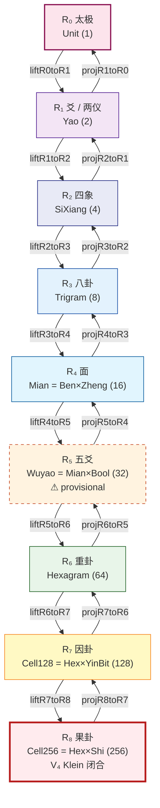
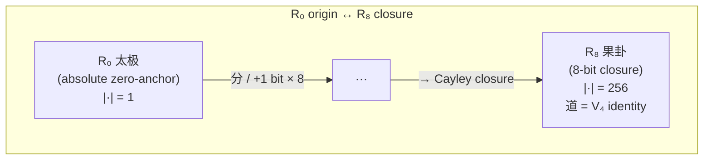
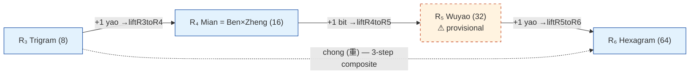
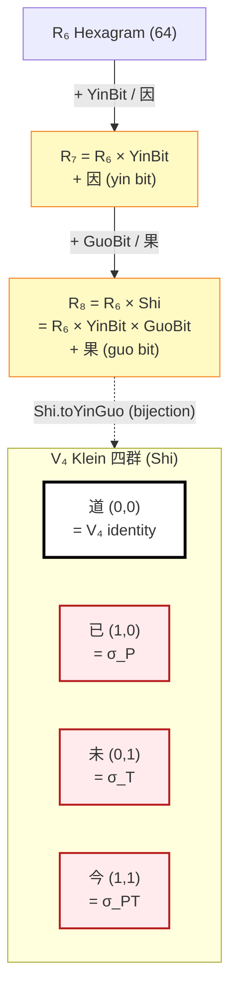
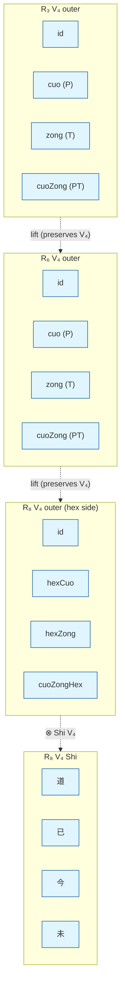
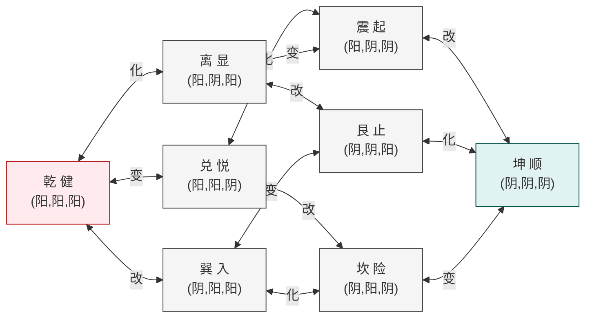
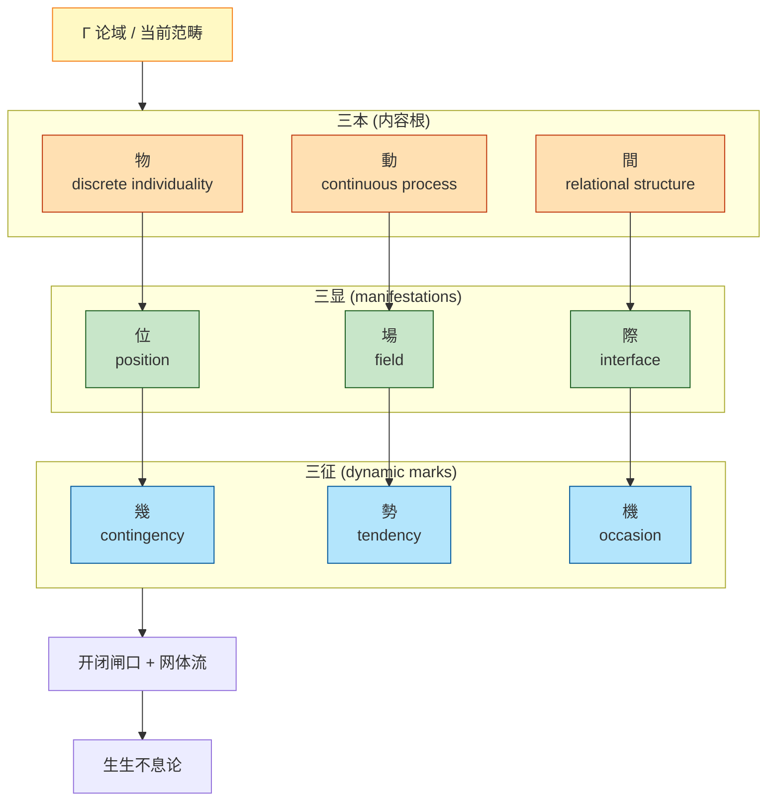
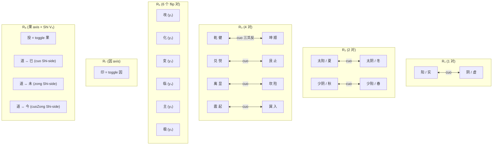
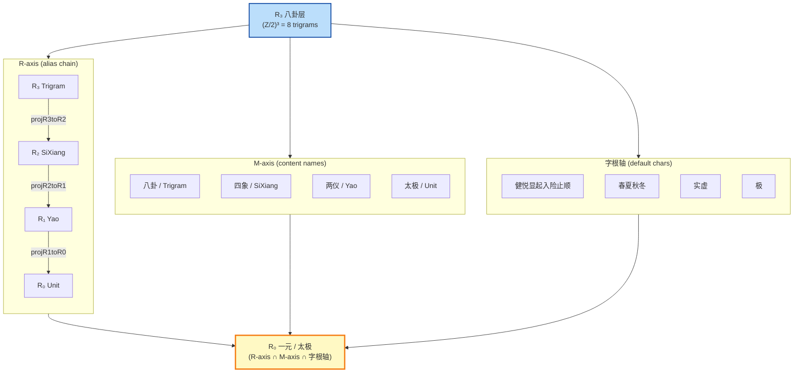

> 状态：v3 定本 (2026-05-11)。
> 父文档：[yi-RO-hierarchy.md](yi-RO-hierarchy.md)
> Lean 入口：[`RHierarchy.lean`](../../formal/SSBX/Foundation/Hierarchy/RHierarchy.lean) · [`LiftProject.lean`](../../formal/SSBX/Foundation/Hierarchy/LiftProject.lean)
> 相关 v3 文档：[root-layer-map.md](root-layer-map.md) · [shi-v4.md](shi-v4.md) · [r5-wuyao-provisional.md](r5-wuyao-provisional.md) · [r7-yin-r8-guo.md](r7-yin-r8-guo.md) · [lift-project.md](lift-project.md) · [ox-notation.md](ox-notation.md) · [cell256-grid.md](cell256-grid.md)

# 层级轴图全景 layer-axis-graph · v3

> 本文是**全景图谱**——把 R₀..R₈ 严格 (Z/2)ⁿ uniform R-轴、内容线、Lift/Project 函子、V₄ outer 对称、Shi V₄ Klein 闭合统一作图。
> v2 (2026-05-09) 含 R₁..R₆ + Cell192 旧 surface；v3 (2026-05-11) 切换到 **R₀..R₈ + Cell256 + V₄ Klein Shi** 之 definitive。

---

## 0. 全景速览（一图）

```text
                          ┌─────────────────────────────┐
                          │  R₀  太极 / 一元 / Unit       │   1
                          │     极 / 一 / 元              │
                          └────────────┬────────────────┘
                                       │ liftR0toR1 / projR1toR0
                          ┌────────────▼────────────────┐
                          │  R₁  爻 / 两仪 / Yao         │   2 = (Z/2)¹
                          │     实 / 虚 (essence)        │
                          └────────────┬────────────────┘
                                       │ liftR1toR2 / projR2toR1
                          ┌────────────▼────────────────┐
                          │  R₂  四象 / SiXiang          │   4 = (Z/2)²
                          │     春/夏/秋/冬             │
                          └────────────┬────────────────┘
                                       │ liftR2toR3 / projR3toR2
                          ┌────────────▼────────────────┐
                          │  R₃  八卦 / Trigram          │   8 = (Z/2)³
                          │     健悦显起入险止顺         │
                          │     V₄ outer: cuo/zong/hu     │
                          └────────────┬────────────────┘
                                       │ liftR3toR4 / projR4toR3   (Trigram + 1 yao → Mian)
                          ┌────────────▼────────────────┐
                          │  R₄  面 / Mian = Ben×Zheng   │  16 = (Z/2)⁴
                          │     16-命 (本×征)            │
                          └────────────┬────────────────┘
                                       │ liftR4toR5 / projR5toR4    ⚠ provisional
                          ┌────────────▼────────────────┐
                          │  R₅  五爻 / Wuyao = Mian×Bool│  32 = (Z/2)⁵
                          │     无传统 anchor (provisional)│
                          └────────────┬────────────────┘
                                       │ liftR5toR6 / projR6toR5
                          ┌────────────▼────────────────┐
                          │  R₆  重卦 / Hexagram          │  64 = (Z/2)⁶
                          │     y₁..y₆ (改/化/变/临/主/极) │
                          │     V₄ outer: cuo/zong/hu     │
                          └────────────┬────────────────┘
                                       │ liftR6toR7 / projR7toR6   (+ YinBit / 因)
                          ┌────────────▼────────────────┐
                          │  R₇  因卦 / Cell128           │ 128 = (Z/2)⁷
                          │     + 因 axis; 印 = toggle   │
                          └────────────┬────────────────┘
                                       │ liftR7toR8 / projR8toR7   (+ GuoBit / 果)
                          ┌────────────▼────────────────┐
                          │  R₈  果卦 / Cell256           │ 256 = (Z/2)⁸
                          │     + 果 axis; 投 = toggle   │
                          │     V₄ Shi {道, 已, 今, 未}   │
                          │     V₄ outer (hex) ⊗ V₄ (Shi) │
                          └─────────────────────────────┘
```

每层之 Lean 锚见 §11。

---

## 1. R-轴主干（R₀..R₈）— Mermaid



每对 (Rₙ, R_{n+1}) 之 lift/project 满足 `proj ∘ lift = id`（retract lemma `proj_lift_id_Rn` in [`LiftProject.lean`](../../formal/SSBX/Foundation/Hierarchy/LiftProject.lean)）。

---

## 2. R₀ 入口与 R₈ 闭合：双端点显式

R-axis 的两个 special points：



- **R₀ Taiji** = absolute zero-anchor，1 元 set，所有 binary distinction 之前的 origin singleton。
- **R₈ Cell256** = (Z/2)⁸ Cayley regular representation 之 closure。无 R₉（无第 9 个独立 binary axis）。
- **道 (R₈ origin)** = V₄ Klein identity = (因, 果) = (0, 0) = `oooooooo`，是太极在 R₈ 维度上的具体落地。

---

## 3. R₃ → R₄ → R₅ → R₆: chong 之 3-step composite

旧 v2 视角下「R₃ → 重卦」是 +3 bit chong jump（跳过 (Z/2)⁴ 与 (Z/2)⁵）。v3 strict-uniform 下显式拆为 3 步：



`chong : R₃ × R₃ → R₆` 在 v3 解读为 **3 步 +1 bit lift composite**；不再是单步 jump。

---

## 4. R₈ V₄ Shi 双层 emergence (因, 果)

V₄ Shi `{道, 已, 今, 未}` 不是 R₇ 单层 atom，而是 R₇ (因 axis) ⊗ R₈ (果 axis) 双 axis 之 emergent 结构：



- 因 axis (R₇): 印 (yìn) = toggle 因 = mask `ooooooxo`
- 果 axis (R₈): 投 (tóu) = toggle 果 = mask `ooooooox`
- Shi.dao = (因=0, 果=0) = V₄ identity = `oo` 后缀 = origin choice
- Shi V₄ block branches from R₇ to R₈

详见 [shi-v4.md](shi-v4.md), [r7-yin-r8-guo.md](r7-yin-r8-guo.md)。

---

## 5. R₃ 与 R₆ 之 V₄ outer (cuo / zong / hu / cuoZong) 对称

V₄ outer 对称在 R₃ / R₆ / R₈ (hex side) 各自存在；R₈ 上 hex-side V₄ 与 Shi-side V₄ tensor 起来给 V₄ × V₄ ≅ (Z/2)⁴。



- `hu (互)` 不在 V₄ — 它有 fixed points 乾/坤，是 sibling 非 V₄ 之 outer op
- Shi-side V₄ 用 `shiCuo / shiZong / shiCuoZong`（in [`Cell256.lean`](../../formal/SSBX/Foundation/Bagua/Cell256.lean)）

详见 [`Operators/V4Outer.lean`](../../formal/SSBX/Foundation/Hierarchy/Operators/V4Outer.lean)。

---

## 6. 八卦内部 (Z/2)³ 群结构 — Mermaid

8 trigram 通过 `改/化/变` 三个 single-bit-flip 形成 (Z/2)³ 群（每两卦最多 3 跳互达）：



cuo (对待) 由对角线给出: 乾↔坤、兑↔艮、离↔坎、震↔巽。

---

## 7. R₈ 8-bit layout 与 algorithmic atomic generators

R₈ 之 8-bit string layout: `[y₁ y₂ y₃ y₄ y₅ y₆ 因 果]`，初爻在左。

| Generator | mask (8-bit) | 翻位 | 字根 |
|---|---|---|---|
| flip1 (dongInner) | `xooooooo` | y₁ | 改 |
| flip2 (huaInner)  | `oxoooooo` | y₂ | 化 |
| flip3 (bianInner) | `ooxooooo` | y₃ | 变 |
| flip4 (dongOuter) | `oooxoooo` | y₄ | 临 |
| flip5 (huaOuter)  | `ooooxooo` | y₅ | 主 |
| flip6 (bianOuter) | `oooooxoo` | y₆ | 极 |
| **印 (yìn)** | `ooooooxo` | y₇ (因) | 印 (provisional) |
| **投 (tóu)** | `ooooooox` | y₈ (果) | 投 (provisional) |

8 atomic generators 完全生成 (Z/2)⁸ 之 256 个 XOR 算子。

详见 [position-operator-tree.md](position-operator-tree.md), [ox-notation.md](ox-notation.md)。

---

## 8. 内容线垂直结构 — Mermaid

内容线（[`JianOntology.lean`](../../formal/SSBX/Foundation/Jian/JianOntology.lean)）与 R-轴正交：



每 三本 引出一个 三显，每 三显 带一个 三征 — 9 字 ordered grid。

---

## 9. cuo 对待跨层全图



各层 cuo 对都是 (Z/2) 反演结构的 reflection；R₈ 上 hex-side cuo 与 Shi-side cuo 复合给 V₄ × V₄ 之 16 个对称变换。

---

## 10. 三轴汇聚（八卦层之 demonstration）



三轴在 R₀..R₂ 几乎重合，R₃ 起开始分化但仍指向同一 algebraic 对象。

---

## 11. Lean 锚定速查

| 节点 | Lean 文件 |
|---|---|
| R₀ Taiji | [`R0_Taiji.lean`](../../formal/SSBX/Foundation/Hierarchy/R0_Taiji.lean) (alias) + Lean stdlib `Unit` |
| R₁ Yao | [`R1_Yao.lean`](../../formal/SSBX/Foundation/Hierarchy/R1_Yao.lean) (alias) + [`Yi.lean`](../../formal/SSBX/Foundation/Yi/Yi.lean) |
| R₂ SiXiang | [`R2_SiXiang.lean`](../../formal/SSBX/Foundation/Hierarchy/R2_SiXiang.lean) (alias) + [`BaguaAlgebra.lean`](../../formal/SSBX/Foundation/Bagua/BaguaAlgebra.lean) |
| R₃ Trigram | [`R3_Trigram.lean`](../../formal/SSBX/Foundation/Hierarchy/R3_Trigram.lean) (alias) + [`Yi.lean`](../../formal/SSBX/Foundation/Yi/Yi.lean) |
| R₄ Mian | [`R4_Mian.lean`](../../formal/SSBX/Foundation/Hierarchy/R4_Mian.lean) (alias) + [`BenZheng.lean`](../../formal/SSBX/Foundation/Bagua/BenZheng.lean) |
| R₅ Wuyao | [`R5_Wuyao.lean`](../../formal/SSBX/Foundation/Hierarchy/R5_Wuyao.lean) (carrier; provisional) |
| R₆ Hexagram | [`R6_Hexagram.lean`](../../formal/SSBX/Foundation/Hierarchy/R6_Hexagram.lean) (alias) + [`Yi.lean`](../../formal/SSBX/Foundation/Yi/Yi.lean) |
| R₇ Cell128 | [`R7_YinHex.lean`](../../formal/SSBX/Foundation/Hierarchy/R7_YinHex.lean) (alias) + [`Cell128.lean`](../../formal/SSBX/Foundation/Bagua/Cell128.lean) |
| R₈ Cell256 | [`R8_GuoHex.lean`](../../formal/SSBX/Foundation/Hierarchy/R8_GuoHex.lean) (alias) + [`Cell256.lean`](../../formal/SSBX/Foundation/Bagua/Cell256.lean) + [`Cell256Stratify.lean`](../../formal/SSBX/Foundation/Bagua/Cell256Stratify.lean) |
| Lift/Project (8 对) | [`LiftProject.lean`](../../formal/SSBX/Foundation/Hierarchy/LiftProject.lean) |
| Atomic XOR ops | [`Operators/Atomic.lean`](../../formal/SSBX/Foundation/Hierarchy/Operators/Atomic.lean) |
| V₄ outer ops | [`Operators/V4Outer.lean`](../../formal/SSBX/Foundation/Hierarchy/Operators/V4Outer.lean) |
| 字根 ground truth | [`LayerCharacterMap.lean`](../../formal/SSBX/Text/LayerCharacterMap.lean) |
| umbrella | [`RHierarchy.lean`](../../formal/SSBX/Foundation/Hierarchy/RHierarchy.lean) |
| OX 字面量 | [`OXNotation.lean`](../../formal/SSBX/Foundation/Notation/OXNotation.lean) |

---

## 12. v2 → v3 之关键改动（migration map）

| v2 | v3 |
|---|---|
| R₁..R₆ 顶层 | **R₀..R₈** strict uniform，每层 +1 bit |
| R₃ → R₄ chong jump (跳过 16, 32) | **3-step composite**: R₃→R₄→R₅→R₆ |
| Cell192 (Z/3 cyclic Shi) | **Cell256 (V₄ Klein Shi)**, Cell192 已删 |
| Hexagram = R₄ | Hexagram = R₆ |
| Cell192 = R₅ | Cell256 = R₈ |
| 已/今/未 | **道/已/今/未** (V₄ + identity 道) |

详见 [yi-RO-hierarchy.md §11](yi-RO-hierarchy.md) v1→v2.1 重号表 + [pending.md](pending.md) cleanup 状态。
