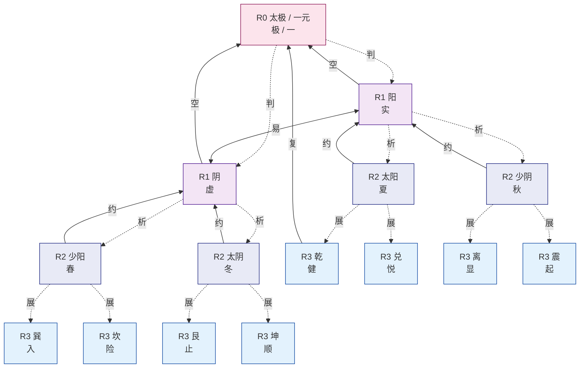
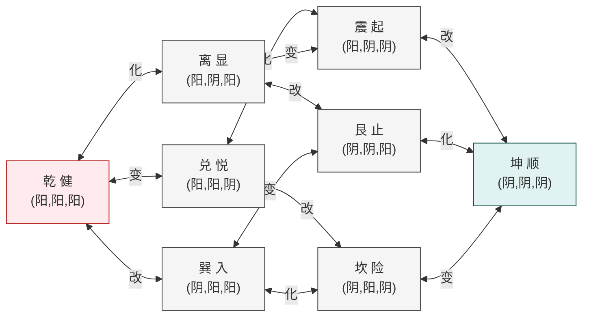
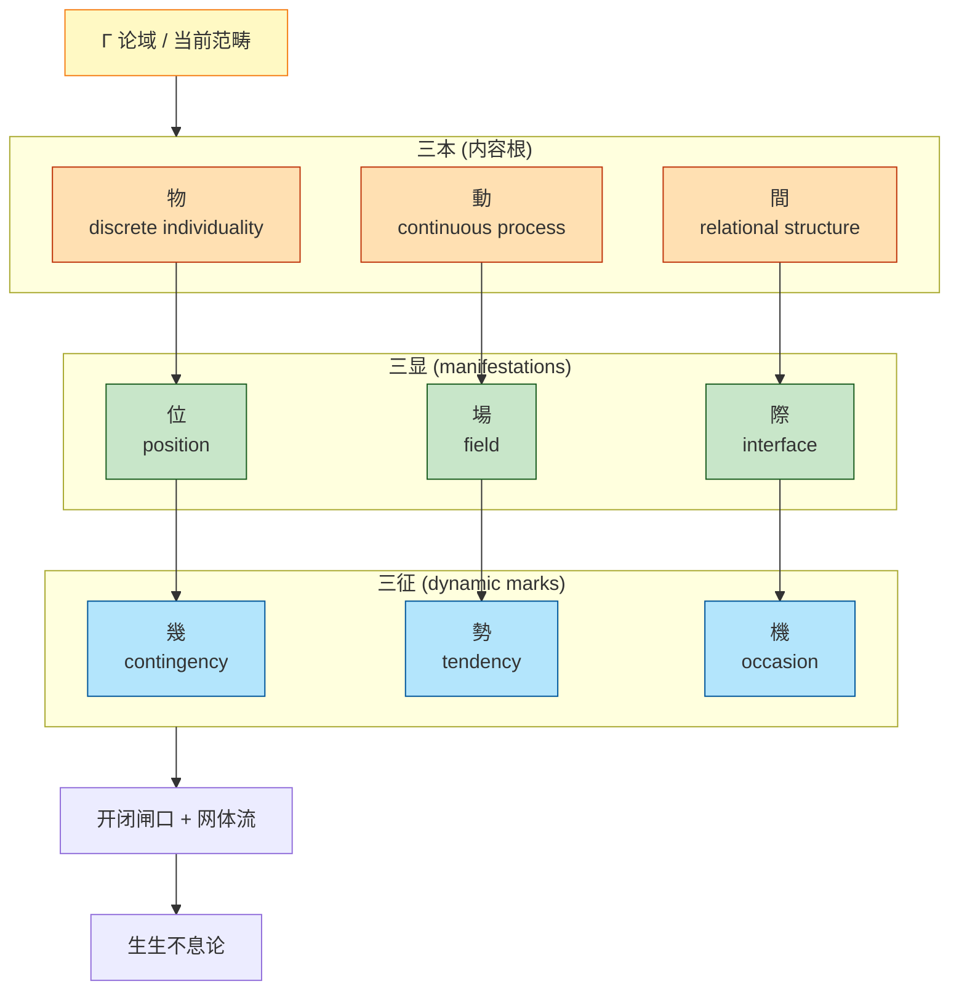
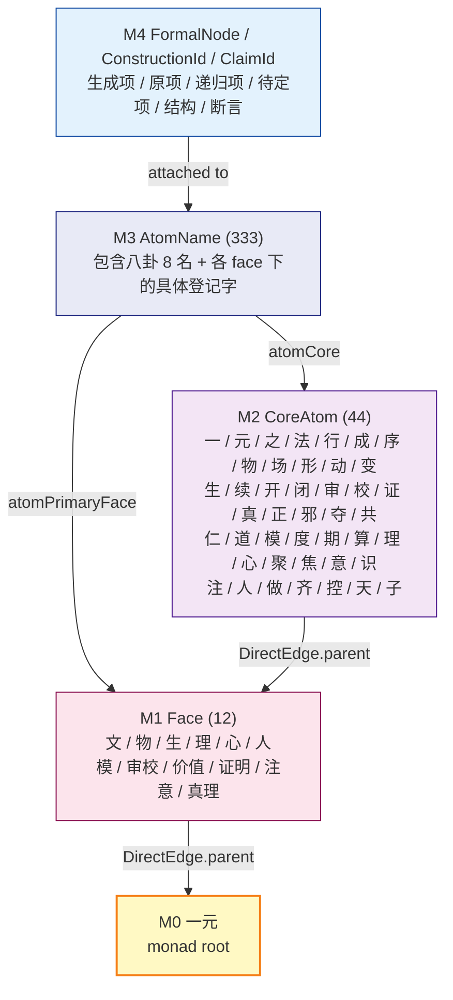
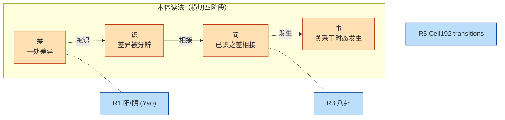
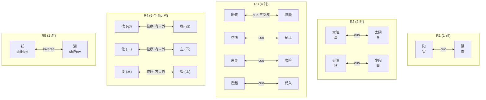

# 层级轴图全景：映射、关系与内在逻辑

> 状态：完整映射定本（2026-05-09）。
> 作用：把 R0–L0 的字根映射、三条轴（生成线 / 名册线 / 内容线）的并存关系、以及"三条轴在八卦层级到 root 的映射转化"用图和表的方式整体表达出来。
> 配套文件：
> - 字详细分析：[layer-character-map.md](layer-character-map.md)（每字的推荐理由 + 备选 + 冲突核查）
> - 结构定义：[root-layer-map.md](root-layer-map.md)（R 层与 M 层结构源）
> - 代码锚点：[`LayerCharacterMap.lean`](../../formal/SSBX/Text/LayerCharacterMap.lean)（解释器 ground truth）

---

## 0. 全景速览（一图）

```
                              ┌─────────────────┐
                              │  一元 / 太极     │  R0 = M0 (生成线 ∩ 名册线之根)
                              │   "极 / 一"      │
                              └────────┬────────┘
                                       │
                ┌──────────────────────┼──────────────────────┐
                │                      │                      │
       ┌────────▼────────┐    ┌────────▼────────┐    ┌────────▼────────┐
       │   生成线         │    │   名册线         │    │   内容线         │
       │   (R-line)       │    │   (M-line)       │    │  (Content)       │
       │                  │    │                  │    │                  │
       │ R1 阳/阴         │    │ M1 12 Face       │    │ Γ 论域            │
       │   实/虚          │    │                  │    │                  │
       │ R2 春夏秋冬      │    │ M2 44 CoreAtom   │    │ 三本 物/動/間     │
       │ R3 八卦↔健悦显   │    │   一/元/物/...   │    │                  │
       │     起入险止顺   │    │                  │    │ 三显 位/場/際     │
       │ R4 64 卦         │    │ M3 333 AtomName  │    │                  │
       │   flip 改化变    │    │                  │    │ 三征 幾/勢/機     │
       │     临主极       │    │ M4 FormalNode    │    │                  │
       │ R5 Cell192       │    │   ClaimId        │    │ 网体流 / 开闭闸   │
       │   Shi 已今未     │    │                  │    │                  │
       │   迁/溯          │    │                  │    │ 生生不息论        │
       │ L0 BaguaWen VM   │    │                  │    │                  │
       │   12 instr       │    │                  │    │                  │
       └──────────────────┘    └──────────────────┘    └──────────────────┘
                │                      │                      │
                ↑ 复 (guiyi)           ↑ DirectEdge.parent     ↑ 三本 ⊆ Γ 嵌
                ↑ 周 (grandCycle)      ↑ Reachable             ↑ 三显 ⊆ 三本 引出
                ↑ 略上/约/空/...       ↑ atomCore / Face       ↑ ...
                                                               
                           本体读法 (横切四阶段)
                           差 → 识 → 间 → 事
                           ↑     ↑     ↑     ↑
                           R1   ?     R3+   R5
                           Yao   M2?   間    transition
```

---

## 1. 三条轴的形式定义

| 轴 | 答什么问题 | Lean 锚 | 字根入口 |
|---|---|---|---|
| **生成线** | 怎么从一元长出可计算的易结构 | [`Yuan.lean`](../../formal/SSBX/Foundation/Core/Yuan.lean) / [`Yi.lean`](../../formal/SSBX/Foundation/Yi/Yi.lean) / [`BaguaAlgebra.lean`](../../formal/SSBX/Foundation/Bagua/BaguaAlgebra.lean) / [`Cell192.lean`](../../formal/SSBX/Foundation/Bagua/Cell192.lean) / [`OperatorAnchors.lean`](../../formal/SSBX/Text/OperatorAnchors.lean) | [`LayerCharacterMap.lean`](../../formal/SSBX/Text/LayerCharacterMap.lean) |
| **名册线** | 一个正式名字怎么回根 | [`MonadRoot.lean`](../../formal/SSBX/Foundation/Core/MonadRoot.lean) / [`Roster.lean`](../../formal/SSBX/Foundation/Core/Roster.lean) | 名册字根直接从 CoreAtom inductive 读 |
| **内容线** | 我们在谈什么样的本体范畴 | [`JianOntology.lean`](../../formal/SSBX/Foundation/Jian/JianOntology.lean) / [`Monism.lean`](../../formal/SSBX/Foundation/Core/Monism.lean) | 三本/三显/三征 字根直接来自 Lean 构造子 |

横切**本体读法** 差/识/间/事 是更先一阶段的现象学读法，与三轴正交。

---

## 2. 完整字符映射（按层）

### R0：太极 / 一元

| 形式锚 | 推荐 | 备选 alias |
|---|---|---|
| 元素 (`Yuan.TaiJi`) | `太极` / `一元`（双字 canonical） | `极`（单字 alias） / `一` (CoreAtom) / `元` (CoreAtom) |
| identity 算子 | `恒` | `静`（L0） / `定` / `常` / `止` / `安` |
| ↓ R0→R1 (`fenToYi`) | `判` | `分` / `开` / `生` |
| ↑ R1→R0 (`heToTaiji`) | `空` | `归一` / `归极` |
| ⤴ R3→R0 (`guiyi`) | `复` | `归一` / `复归` |
| ↻ 闭环 (`grandCycle`) | `周` | `周行` / `循环` |

### R1：爻 / 两仪

| 形式锚 | 推荐 | 备选 alias |
|---|---|---|
| `Yao.yang` | `阳`（literal）+ `实`（义理读） | 升 / 健 / 显 / 动（撞） |
| `Yao.yin` | `阴`（literal）+ `虚`（义理读） | 降 / 顺 / 隐 / 静（撞） |
| `Yao.neg` / `yi` | `易` | 反 / 翻 / 转 / 化 |
| ↓ R1→R2 (`fenToSiXiang`) | `析` | 分象 / 衍 |
| ↑ R2→R1 (`heToYi`) | `约` | 合仪 / 归仪 |

### R2：四象

| 元素 | (上,下) | 双字 canonical | 推荐单字 |
|---|---|---|---|
| `SiXiang.taiYang` | (阳,阳) | 太阳 / 老阳 | **`夏`** |
| `SiXiang.shaoYin` | (阳,阴) | 少阴 | **`秋`** |
| `SiXiang.shaoYang` | (阴,阳) | 少阳 | **`春`** |
| `SiXiang.taiYin` | (阴,阴) | 太阴 / 老阴 | **`冬`** |

| 跨层算子 | 推荐 |
|---|---|
| ↓ R2→R3 (`fenToTrigram`) | `展` |
| ↑ R3→R2 (`heShang/heZhong/heXia`) | `略上 / 略中 / 略下` |

### R3：八卦

| Trigram | (y1,y2,y3) | literal | mode 字（推荐） | 《说卦传》原德 |
|---|---|---|---|---|
| `qian` | (阳,阳,阳) | 乾 | **`健`** | 健 |
| `dui` | (阳,阳,阴) | 兑 | **`悦`** | 说 |
| `li` | (阳,阴,阳) | 离 | **`显`** | 丽 |
| `zhen` | (阳,阴,阴) | 震 | **`起`** | 动 |
| `xun` | (阴,阳,阳) | 巽 | **`入`** | 入 |
| `kan` | (阴,阳,阴) | 坎 | **`险`** | 陷 |
| `gen` | (阴,阴,阳) | 艮 | **`止`** | 止 |
| `kun` | (阴,阴,阴) | 坤 | **`顺`** | 顺 |

| R3 算子 | Lean | 推荐 |
|---|---|---|
| flip y1 | `dong` | `改` |
| flip y2 | `hua` | `化` |
| flip y3 | `bian` | `变` |
| 全反 | `cuo` | `错` |
| 反序 | `zong` | `综` |
| 错∘综 | `cuoZong` | `错综`（双字） |
| 内取互 | `hu` | `互` |
| ↓ R3→R4 重卦 | `chong` | `乘` |

### R4：六十四卦

| 6-yao flip | Fin 6 | 推荐 | 来历 |
|---|---|---|---|
| 初爻 | 0 | `改` | 沿用 R3 dong |
| 二爻 | 1 | `化` | 沿用 R3 hua |
| 三爻 | 2 | `变` | 沿用 R3 bian |
| 四爻 | 3 | **`临`** ⭐ | 19 临卦 / 近君位临察 |
| 五爻 | 4 | **`主`** ⭐ | 君位 / 主导 |
| 上爻 | 5 | `极` | 亢龙极位 |

| 整卦算子 | Lean | 推荐 |
|---|---|---|
| 全反 | `Hexagram.cuo` | `错` |
| 反序 | `Hexagram.zong` | `综` |
| 取中四 | `Hexagram.hu` | `互` |
| 错综 | `cuoZongBody` | `错综` |
| 度量 | `hexHammingDist` | `度` |
| 直接变换 | `hexTransform` | `达` |
| 路径 | `pathFromTo` | `径` |
| 群作用 | `FlipCombo.apply` | `群` |

### R5：Cell192

| Shi | 推荐 |
|---|---|
| `Shi.ji` | `已` |
| `Shi.jin` | `今` |
| `Shi.wei` | `未` |
| `shiNext` | **`迁`** ⭐ |
| `shiPrev` | **`溯`** ⭐ |
| `setShi` | `置` |
| Cell-级算子 | R4 字 + `格` 后缀 |

### L0：BaguaWen VM

| YiInstrKind | token (现存) | modern alias (新增) |
|---|---|---|
| `.nop` | 不动 | `静` |
| `.setShi` | 设时 | `置` |
| `.flipYao` | 翻爻 | `翻` |
| `.hu` | 互 | `互` |
| `.cuo` | 错 | `错` |
| `.zong` | 综 | `综` |
| `.branchYaoEq` | 比爻 | `侔` |
| `.branchShiEq` | 比时 | `会` |
| `.jump` | 跳 | `跳` |
| `.push` | 推 | `推` |
| `.pop` | 取 | `取` |
| `.halt` | 终 | `终` |

---

## 3. 生成线主干（R0 → R3）— Mermaid

下行（生）+ 上行（合）+ 横向（爻位翻转）全部画出。



实线箭头 = 上行（合 / 收回 / guiyi），虚线箭头 = 下行（分 / 展 / 生）。`易` 是 R1 内部的双向算子。

---

## 4. 八卦内部 (Z/2)³ 群结构 — Mermaid

8 个 trigram 通过 `改/化/变` 三个 single-bit-flip 形成 (Z/2)³ 群。每两卦最多 3 跳互达。



**对待**（cuo = 三爻全反）由对角线给出：
- 乾 ↔ 坤（健 ↔ 顺）
- 兑 ↔ 艮（悦 ↔ 止）
- 离 ↔ 坎（显 ↔ 险）
- 震 ↔ 巽（起 ↔ 入）

---

## 5. R3 → R4 → R5 维度提升

```mermaid
graph TD
    subgraph R3["R3 八卦 (Yao³, 8 元素)"]
      direction LR
      T["乾兑离震巽坎艮坤"]
    end

    subgraph R4["R4 六十四卦 (Yao⁶, 64 元素)"]
      direction LR
      H["64 卦 = inner ⊕ outer"]
    end

    subgraph R5["R5 Cell192 (Hexagram × Shi, 192 元素)"]
      direction LR
      C["192 格 = 卦 × 时"]
    end

    subgraph L0["L0 BaguaWen VM (受控指令机)"]
      direction LR
      VM["12 条指令<br>静置翻互错综侔会跳推取终"]
    end

    R3 -->|乘 chong| R4
    R4 -->|× Shi {已今未}| R5
    R5 -->|VM 解释| L0

    R3 -.->|改化变 错综 互| R3
    R4 -.->|改化变临主极<br>错综互| R4
    R5 -.->|改格化格变格临格主格极格<br>错格综格互格<br>迁溯置| R5
```

---

## 6. 三轴汇聚 at 八卦层 — 核心图

这是回答 "八卦 怎么映回 root，分别按三条线" 的核心图。

```mermaid
graph TD
    ROOT["一元 / 太极<br>(R0 = M0)"]

    %% R3 八卦 中心
    BAGUA["R3 八卦层<br>{乾, 兑, 离, 震, 巽, 坎, 艮, 坤}"]

    %% 生成线 路径
    subgraph GenLine["生成线 (R-line) 回根路径"]
      direction TB
      G_R3["R3 八卦"]
      G_R2["R2 四象"]
      G_R1["R1 两仪"]
      G_R0["R0 太极"]
      G_R3 -->|略上/略中/略下| G_R2
      G_R2 -->|约| G_R1
      G_R1 -->|空| G_R0
      G_R3 -.->|复 (guiyi 直接)| G_R0
    end

    %% 名册线 路径
    subgraph NameLine["名册线 (M-line) 回根路径"]
      direction TB
      N_M3["M3 AtomName<br>e.g. 「乾」 「健」「悦」"]
      N_M2["M2 CoreAtom<br>e.g. 物 / 形 / 道 / 元"]
      N_M1["M1 Face (12)<br>e.g. 真理面 / 物面"]
      N_M0["M0 一元"]
      N_M3 -->|atomCore| N_M2
      N_M2 -->|atomPrimaryFace| N_M1
      N_M1 -->|DirectEdge.parent| N_M0
    end

    %% 内容线 路径
    subgraph ContentLine["内容线 回根路径"]
      direction TB
      C_BAG["八卦实例化<br>(JianMode 8 模式)"]
      C_3BEN["三本: 物 / 動 / 間"]
      C_3SHOW["三显: 位 / 場 / 際"]
      C_3MARK["三征: 幾 / 勢 / 機"]
      C_GAMMA["论域 Γ"]
      C_BAG -->|抽象到 三本范畴| C_3BEN
      C_3BEN -->|引出 三显| C_3SHOW
      C_3SHOW -->|带 三征| C_3MARK
      C_3MARK -->|嵌入 Γ| C_GAMMA
    end

    BAGUA --> GenLine
    BAGUA --> NameLine
    BAGUA --> ContentLine
    GenLine --> ROOT
    NameLine --> ROOT
    ContentLine --> ROOT

    classDef root fill:#fff9c4,stroke:#f57f17,stroke-width:3px
    classDef bagua fill:#bbdefb,stroke:#0d47a1,stroke-width:2px
    class ROOT root
    class BAGUA bagua
```

**三条路径的本质区别**：

| 轴 | 八卦层是什么 | 怎么回根 | 回根算子 / 关系 |
|---|---|---|---|
| 生成线 | (Z/2)³ 群上的 8 个状态 | 通过 `略 / 约 / 空` 一层层遗忘爻 / 直接 `复` | 形式算子（`heShang`、`heToYi`、`heToTaiji`、`guiyi`）|
| 名册线 | 8 个 AtomName（乾兑离震巽坎艮坤）| 每个 AtomName → CoreAtom → Face → 一元 | 直接 lookup（`atomCore`、`atomPrimaryFace`、`DirectEdge.parent`）|
| 内容线 | 8 个 JianMode（间生论模式）| 抽象为 三本 / 三显 / 三征 范畴，最终嵌入 Γ | 范畴归纳（不是算子，是层级嵌入）|

**关键洞察**：八卦层是三条轴**唯一的明确交点**——
- 在 R-line 上它是 R3
- 在 M-line 上每卦都有 AtomName 登记
- 在内容线上每卦对应一个 JianMode（间生论模式），可作为 三本 范畴的具体实例化

这就是为什么本表把"八卦字根"作为整个映射的核心来定。

---

## 7. 内容线垂直结构 — Mermaid



每个 三本 引出一个 三显，每个 三显 带一个 三征——三本三显三征是 9 个字的有序网格：

| 三本 | 三显 | 三征 |
|---|---|---|
| 物 | 位 | 幾 |
| 動 | 場 | 勢 |
| 間 | 際 | 機 |

---

## 8. 名册线垂直结构 — Mermaid



DAG relations:
- `DirectEdge.parent : MonadNode → MonadNode` — 直接父节点
- `Reachable : MonadNode → MonadNode → Prop` — 可达（传递闭包）
- `atomCore : AtomName → CoreAtom`
- `atomPrimaryFace : AtomName → Face`

详 [`MonadRoot.lean`](../../formal/SSBX/Foundation/Core/MonadRoot.lean) 与 [`MonadDAG.md`](../../formal/SSBX/notes/MonadDAG.md)。

---

## 9. 本体读法（差/识/间/事）四阶段横切



`差 ≈ R1 yao`、`识` 是过渡阶段（不在任一已 register 层）、`间 ≈ R3+ 之间的关系（与内容线 三本之 間 双登记）`、`事 ≈ R5 transition`。

---

## 10. cuo 对待跨层全图



各层 cuo 对都是 (Z/2) 反演结构的 reflection。

---

## 11. 字根复用图（同字跨层 / 跨轴）

```mermaid
graph TD
    subgraph Reuse["跨轴 / 跨层共字"]
      direction TB
      WU["「物」<br>内容线 三本 + M2 CoreAtom"]
      DONG["「動 / 动」<br>内容线 三本 + R3 dong + M2 CoreAtom"]
      JIAN["「間 / 间」<br>内容线 三本 + 本体读法 第三阶段"]
      SHI_EVENT["「事」<br>本体读法 第四阶段 ≈ R5 transition (未 register)"]
      YUAN["「缘」<br>不属任何 register 层 (候选)"]
      XIAN["「显」<br>R3 离 mode + Sheng.toTrigram default"]
      ZHI["「止」<br>R3 艮 mode + identity alias 集"]
      RU["「入」<br>R3 巽 mode + 气机宽义"]
      LI_NAME["「离」<br>R3 trigram + 30 卦名"]
      LIN["「临」<br>R4 flip4 + 19 临卦"]
      ZHU["「主」<br>R4 flip5 + 主体宽义"]
      JI_POLE["「极」<br>R4 flip6 + 太极"]
    end

    classDef bothAxes fill:#ffccbc,stroke:#bf360c
    classDef sameDir fill:#dcedc8,stroke:#33691e
    classDef pending fill:#f8bbd0,stroke:#880e4f

    class WU,DONG,JIAN bothAxes
    class XIAN,ZHI,RU,LIN,ZHU,JI_POLE,LI_NAME sameDir
    class SHI_EVENT,YUAN pending
```



| 颜色 | 含义 |
|---|---|
| 橙 | 跨轴双登记（内容线 + 名册线 / 本体读法） — 有意设计 |
| 绿 | 同方向弱双用 — context 区分即可 |
| 粉 | 待 register / 候选状态 |

---

## 12. 内在逻辑结构（怎么读这套图）

### 12.1 从 root 到 八卦的三种"长出"方式

1. **形式生成**（生成线）：太极 ⟶ 引入一爻得两仪 ⟶ 再加一爻得四象 ⟶ 再加一爻得八卦。这是**纯结构性**的——每加一爻把前一层笛卡尔积一次。
2. **名册登记**（名册线）：从根 一元 出发，先分出 12 个 Face（领域），每个 Face 下有若干 CoreAtom（字根），CoreAtom 派生 AtomName（具体登记字）。八卦 8 卦在 M-line 上是 8 个 AtomName，挂在合适的 face 下（`乾/坤/离/坎` 等多有"物面/真理面"主归面）。
3. **内容引出**（内容线）：从 Γ 论域出发，先分出 三本（物/動/間）三个本体范畴，每个引出 三显（manifestation），每个 三显 带 三征（dynamic mark），最后构成 网体流 + 开闭闸口 ⟶ 生生不息论。八卦 8 卦在内容线上是 间生论 (JianMode) 的 8 个具体模式。

### 12.2 从 八卦 到 root 的三种"回归"方式

1. **形式收束**（生成线 反方向）：八卦 ⟶ `略上/略中/略下` 取下二爻 ⟶ 四象 ⟶ `约` ⟶ 两仪 ⟶ `空` ⟶ 太极；或者直接 `复` (guiyi) 一步到底。
2. **DAG 上溯**（名册线 反方向）：每个 AtomName ⟶ `atomCore` ⟶ CoreAtom ⟶ `atomPrimaryFace` ⟶ Face ⟶ `DirectEdge.parent` ⟶ 一元。这是查表式的，不是计算。
3. **范畴抽象**（内容线 反方向）：8 卦的具体 mode ⟶ 抽象为 三本 范畴 ⟶ 嵌入 Γ。这不是算子，是 type-level 抽象。

### 12.3 三条线在八卦的"和"与"分"

**和**（同一层共点）：
- 八卦的每一卦在三条线上都有"位置"
- 例如 `乾`：
  - 生成线：R3 的 (阳,阳,阳) 状态点
  - 名册线：M3 AtomName「乾」，挂在 ?面（需查 [Roster.lean](../../formal/SSBX/Foundation/Core/Roster.lean)）
  - 内容线：JianMode 之一（"sheng" 模式 ↔ qian），可读为"动力 / 创生" 的 mode

**分**（语义不同）：
- 同样是「乾」，三条线给的"是什么"不同：
  - 生成线说"它是 (Z/2)³ 群里全阳那个状态"
  - 名册线说"它是登记字'乾'，主归 X 面，字根是 Y CoreAtom"
  - 内容线说"它是 间生论 8 模式中表征'生 / 健 / 创' 的那个范畴"

### 12.4 "字恰当高于冲突"的指导意义

本表的命名按四级权重排：
1. 传统准确性（说卦 / 邵雍 / 系辞 / 序卦的字根 anchor）
2. (Z/2)ⁿ 对待结构
3. 冲突最小化
4. 单字读得通

第一条排第一是因为：**字本身的传统含义比工程"洁癖"重要**。`健 / 顺` 比 candidates 的 `生 / 守` 更准——即使 `健 / 顺` 与已有 reading 有弱双用，传统准确性的收益远大于 disambiguation 的代价。

---

## 13. 代码锚点（解释器 ground truth）

### 主文件

[`formal/SSBX/Text/LayerCharacterMap.lean`](../../formal/SSBX/Text/LayerCharacterMap.lean)

```
namespace SSBX.Foundation.Yi.Yi.Yao
  def essenceChar : Yao → String          -- 实/虚
  def fromEssenceChar : String → Option Yao
  theorem essence_roundtrip ...

namespace SSBX.Foundation.Bagua.BaguaAlgebra.SiXiang
  def seasonChar : SiXiang → String       -- 春/夏/秋/冬
  def fromSeasonChar : String → Option SiXiang

namespace SSBX.Foundation.Yi.Yi.Trigram
  def virtueChar : Trigram → String       -- 健/悦/显/起/入/险/止/顺
  def fromVirtueChar : String → Option Trigram
  def literalChar : Trigram → String      -- 乾/兑/离/震/巽/坎/艮/坤
  theorem virtue_roundtrip ...

namespace SSBX.Text.LayerCharacterMap
  def flipPositionChar : Fin 6 → String   -- 改/化/变/临/主/极
  def fromFlipPositionChar : String → Option (Fin 6)
  theorem flipPosition_roundtrip ...

  inductive ShiTransition           -- next / prev
    namespace ShiTransition
      def char : ShiTransition → String   -- 迁/溯
      def fromChar : String → Option ShiTransition
      def apply : ShiTransition → Shi → Shi
      theorem char_roundtrip ...

namespace SSBX.Text.OperatorAnchors.YiInstrKind
  def modernAlias : YiInstrKind → String  -- 静/置/翻/...
  def fromModernAlias : String → Option YiInstrKind
  theorem modernAlias_roundtrip ...

namespace SSBX.Text.LayerCharacterMap
  structure LayerChar
  def allLayerChars : List LayerChar      -- 42 entries 全表
  def charsForLayer : String → List LayerChar
  theorem r1/r2/r3/r4/r5/l0_chars_count ...
```

### 解释器接入点

未来当解释器需要识别这些字时，应该：
1. 调用 `Trigram.fromVirtueChar / fromLiteralChar` 把字符 lookup 成 Trigram
2. 调用 `fromFlipPositionChar` 把字符 lookup 成 `Fin 6`（爻位 index）
3. 调用 `ShiTransition.fromChar` lookup 时态算子
4. 调用 `YiInstrKind.fromModernAlias` lookup L0 指令
5. `allLayerChars` 提供完整可搜索字表（按 layer / role 过滤）

### 待办（接入解释器）

- [ ] [`WenSurface/Lex.lean`](../../formal/SSBX/Foundation/Wen/WenSurface/Lex.lean) 把上述 lookup 函数接入词法分析
- [ ] [`WenyanParserGeneral.lean`](../../formal/SSBX/Foundation/Wen/WenyanParserGeneral.lean) accept aliases alongside primary tokens
- [ ] 添加 surface alias test: 解析 `健 乾` 应等同于 解析 `乾`
- [ ] CompCanonical printer 决定输出 alias 还是 canonical 名

---

## 14. 与其它文件的关系

| 文件 | 角色 |
|---|---|
| [layer-character-map.md](layer-character-map.md) | **细化分析**：每字推荐理由 + 6-8 个备选 each with reason |
| [root-layer-map.md](root-layer-map.md) | **结构源**：定义 R-line 与 M-line 的层结构 |
| [LayerCharacterMap.lean](../../formal/SSBX/Text/LayerCharacterMap.lean) | **代码 ground truth**：字根映射函数 + 往返定理 |
| [bagua-operator-name-candidates.md](../40_reference_参考/bagua-operator-name-candidates.md) | **历史工作稿**（已被本组三件套替代，将降级为 archive pointer） |
| [JianOntology.lean](../../formal/SSBX/Foundation/Jian/JianOntology.lean) | **内容线 ground truth**：三本/三显/三征 的 Lean 类型定义 |
| [MonadRoot.lean](../../formal/SSBX/Foundation/Core/MonadRoot.lean) | **名册线 ground truth**：Face/CoreAtom/AtomName 的 Lean 类型定义 |
