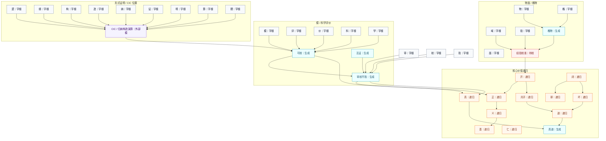

# Concept DAG / 概念有向无环图

方向约定：`字根 / 依赖项 --> 生成项 / 递归项`。

边界声明：`ConceptDAG` 是名册依赖图，不是单根生成证明；单根证明以 `MonadDAG` 和 `Foundation/MonadRoot.lean` 为准。

## 完整性口径

这次的“完整图”不是摘要图，而是覆盖 Lean 名册中全部登记项：

- `AtomName`：333 个
- `GenName`：134 个
- `PrimName`：5 个
- `RecName`：13 个
- `PendingName`：6 个
- 总节点：491 个
- 依赖边：458 条
- 环检测：无环，可作为 DAG 阅读

## 核心摘要图

这张只用于说明主干，不声称完整。

## 完整图文件

- [ConceptDAG.complete.mmd](./ConceptDAG.complete.mmd)：完整登记图，所有名册节点都显示，包括孤立字根、原始算子、待校项。
- [ConceptDAG.layered.mmd](./ConceptDAG.layered.mmd)：完整分层图，按字根、生成项、递归项、原始算子项、待校项分组。
- [ConceptDAG.full.mmd](./ConceptDAG.full.mmd)：同完整登记图，保留旧文件名用于兼容。

## 读法

- `atom`：单字根，不再向下拆。
- `generated`：由字根或其他生成项合成。
- `primitive`：模型/度量/算子接口，不由字元生成。
- `recursive`：价值/真理类递归谓词，需要三值、不动点或外部审校语义。
- `pending`：经验或模型项，不能冒称已真。
- `external`：说明性外部对象，例如 CIC；它参与摘要说明，但不是当前名册中的生成项。

## 注意

这张图证明的是“名册依赖形状可作为 DAG 展示”。它不是额外哲学证明；哲学真理仍由 `Truth` 和 `Model` 层的公理账本与模型充分性承载。
