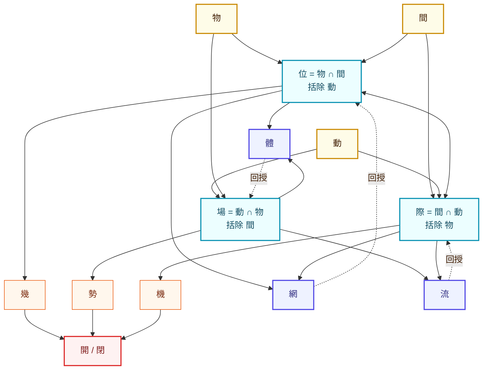

# 間/Jian 本体三联架构

对应 Lean 模块：[`Foundation/JianOntology.lean`](./Foundation/JianOntology.lean)。

本节把 Tier 1 本体词汇压缩为 14 字：

```text
三本：物 動 間
三显：位 場 際
三征：幾 勢 機
闸口：開 閉
合成：網 體 流
```

Lean 层保持既有名册的规范化原则：已经登记为简体 canonical atom 的概念继续使用既有 `AtomName`，繁体写法由 glyph 层覆盖。因此 `動/間/場/幾/勢/機/開/閉` 等作为文本面写法进入 `Tier1Term`，但不会被拆成与 `动/间/场/几/势/机/开/闭` 竞争的第二套本体节点。`際/網/體` 当前作为 glyph-only Tier 1 术语保留，尚不冒充已有 canonical atom。

## 三本

`OnticRoot` 给出不可再分的三本：

| 本 | Lean 构造 | 含义 | 维度征 |
|---|---|---|---|
| 物 | `.wu` | 离散个体性 | 0 维倾向 |
| 動 | `.dong` | 连续过程性 | n 维倾向 |
| 間 | `.jian` | 关系结构性 | 拓扑倾向，无内在度量 |

三本不是三类事物，而是同一现象被观察时显出的三个不可还原面向。

## 三显

`Manifestation.visibleRoots` 与 `Manifestation.bracketedRoot` 形式化三显：

| 显 | 相交 | 括除 | Lean 定理 |
|---|---|---|---|
| 位 | 物 ∩ 間 | 動 | `wei_is_wu_jian_with_dong_bracketed` |
| 場 | 動 ∩ 物 | 間 | `chang_is_dong_wu_with_jian_bracketed` |
| 際 | 間 ∩ 動 | 物 | `ji_is_jian_dong_with_wu_bracketed` |

核心约束：

```lean
every_manifestation_brackets_absent_root
```

即每一显只显出两本，第三本被括除但不缺席。

## 三征与開閉

`DynamicMark.ofManifestation` 规定：

```text
位 -> 幾
場 -> 勢
際 -> 機
```

`Gate.result` 规定二值闸口：

```text
幾開 -> 生    幾閉 -> 灭
勢開 -> 成    勢閉 -> 反
機開 -> 转    機閉 -> 守
```

Lean 中的 `gate_is_only_open_or_closed` 说明 `開/閉` 是此层唯一二值算子；`gate_results` 给出三征经闸口落到事件的完整表。

## 合成与回授

`CompositeForm.parts` 给出三种拓扑合成：

| 合成 | 由何组装 | 形态 |
|---|---|---|
| 網 | 位 + 際 | 关系图 |
| 體 | 位 + 場 | 实体 |
| 流 | 場 + 際 | 过程 |

`CompositeForm.feedbackTarget` 给出回授：

```text
網 -> 位
體 -> 場
流 -> 際
```

`network_composition_arrangement_not_unique` 明确合成不是可逆还原：同样的 `位 + 際` 可以有不同 arrangement，因此从显化原子到合成层会增加结构信息。

## 四条通路



四条通路在 Lean 中分别对应：

- 显化互生：`mutuallyManifest`、`wei_ji_mutually_manifest`
- 显化合成：`Composes`、`composition_table`
- 动征驱动：`Drives`、`dynamic_drive_table`
- 合成回授：`feedback_table`

## 自指性

`SelfReferenceWitness` 把本架构本身登记为自身描述结构的一个实例：

```text
它是 間 结构；
被运用时为 動；
落在 場 中；
生成 位；
经由 際 连接；
织成 網。
```

对应定理：

```lean
ontology_is_instance_of_its_own_shape
```

这就是此处的 homoiconicity：理论不是站在外部描述现象，而是所描述结构的一个实例。
