# Attention / 注意、聚焦与子

本模块形式化 `聚焦`、`子` 与 `attention / 注意` 的区别：

- `聚焦` 是成子过程：场中某处由散而聚、由未指而可指。
- `子` 是聚焦所成的结构项。
- `注意` 是机制/动态项：系统如何对可能焦点进行权重分配、门控、维持、转焦、抑制和回观可校。
- `聚焦` 与 `注意` 共享基底，但不是同一登记项、不是同一概念层。
- 注意可以向齐生，并作为 `做人注意` 支持 `做人`；但 `控制` 只允许作为局部机制，不是 `做人` 的目标。

对应 Lean 模块：[`Foundation/Core/Attention.lean`](../Foundation/Core/Attention.lean)。

## Lean 中证明的内容

- `focus_forms_child`：`子` 依赖 `聚焦`。
- `attention_depends_on_focus`：`注意` 依赖 `聚焦`。
- `attention_mechanism_has_components`：`注意机制` 由 `动态权重分配、门控、维持、转焦、抑制、回观可校` 构成。
- `focus_not_identical_attention`：`聚焦` 与 `注意` 不是同一登记项。
- `focus_and_attention_have_different_layers`：`聚焦` 在成子/形成层，`注意` 在机制层。
- `attention_and_focus_share_substrate`：二者共享 `场、焦、感、识、择、权、重、阈、扰、稳、回、观、意图` 等基底。
- `cognitive_attention_patterns_registered`：认知科学中的注意模式已映射到登记项。
- `attention_can_be_aligned_to_life`：`注意向齐生 = 注意 + 向齐生`。
- `aligned_attention_supports_doing_human`：`做人注意 = 做人 + 注意向齐生`。
- `control_can_be_local_mechanism_but_not_doing_goal`：控制可作为局部执行机制，但不进入 `做人` 目标定义。

## 图

```mermaid
%% Attention construction DAG. Direction: predecessor --> constructed stage.
flowchart TB
  focus["聚焦\n成子过程"]:::formation
  child["子\n聚焦所成之结构项"]:::structure
  mechanism["注意机制\n动态调配"]:::mechanism
  attention["注意 / Attention\n机制/动态"]:::attention

  weight["动态权重分配"]:::component
  gate["门控"]:::component
  maintain["维持"]:::component
  shift["转焦"]:::component
  inhibit["抑制"]:::component
  audit["回观可校"]:::component

  substrate["共享基底\n场/焦/感/识/择/权/重/阈/扰/稳/回/观/意图"]:::substrate
  focusBase["聚焦基底\n含子"]:::substrate
  attentionBase["注意基底"]:::substrate

  bottom["自下而上注意\nbottom-up salience"]:::pattern
  top["自上而下注意\ntop-down attention"]:::pattern
  selective["择注意\nselective attention"]:::pattern
  sustained["持续注意\nsustained attention"]:::pattern
  executive["执行控制\nlocal control mechanism"]:::pattern
  memory["工作记忆\nworking memory"]:::pattern
  conscious["意识通达\nconscious access"]:::pattern

  aligned["注意向齐生\naligned attention"]:::align
  doingAttention["做人注意\n支持做人，不以控为目标"]:::doing

  focus --> child
  weight --> mechanism
  gate --> mechanism
  maintain --> mechanism
  shift --> mechanism
  inhibit --> mechanism
  audit --> mechanism
  focus --> attention
  mechanism --> attention

  substrate --> focusBase
  substrate --> attentionBase
  focus --> focusBase
  child --> focusBase
  attention --> attentionBase

  attention --> bottom
  attention --> top
  attention --> selective
  attention --> sustained
  attention --> shift
  attention --> executive
  attention --> memory
  attention --> conscious
  attention --> aligned
  aligned --> doingAttention

  classDef formation fill:#ecfeff,stroke:#0891b2,color:#164e63,stroke-width:2px;
  classDef structure fill:#eef2ff,stroke:#4f46e5,color:#312e81,stroke-width:2px;
  classDef mechanism fill:#eef2ff,stroke:#4f46e5,color:#312e81,stroke-width:2px;
  classDef attention fill:#fefce8,stroke:#ca8a04,color:#422006,stroke-width:3px;
  classDef component fill:#f8fafc,stroke:#64748b,color:#0f172a;
  classDef substrate fill:#f0fdf4,stroke:#16a34a,color:#14532d;
  classDef pattern fill:#fff7ed,stroke:#ea580c,color:#7c2d12;
  classDef align fill:#fdf2f8,stroke:#db2777,color:#831843,stroke-width:2px;
  classDef doing fill:#fef2f2,stroke:#dc2626,color:#7f1d1d,stroke-width:3px;
```

