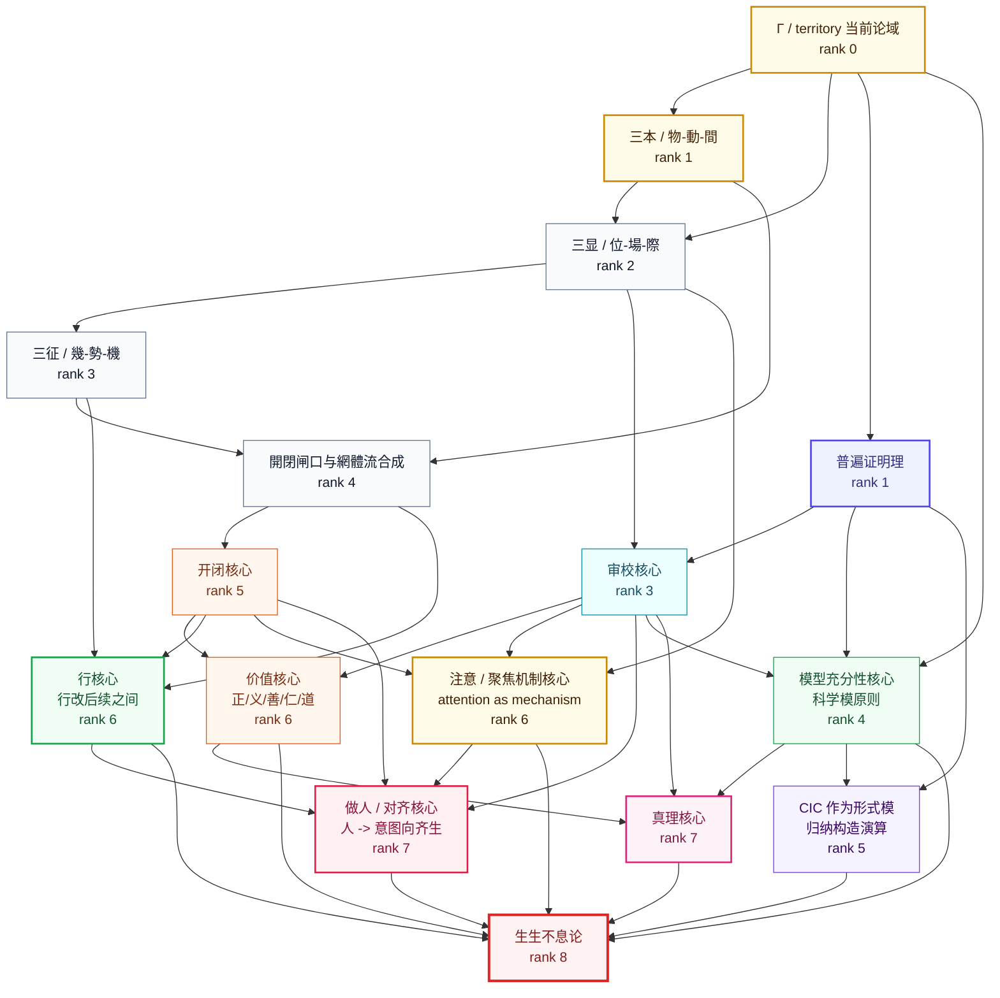

# Construction DAG / 构造证明图

这张图和 `ConceptDAG.*` 不同：

- `ConceptDAG` 是名册依赖图，证明登记项覆盖和无环。
- `ConstructionDAG` 是内容构造图，表达“从 Γ 当前论域出发，经三本、三显、三征、開閉与拓扑合成，构造生生不息论”。

对应 Lean 模块：[`Foundation/Core/Monism.lean`](../Foundation/Core/Monism.lean)。

Lean 中已经证明的形状：

- `construction_ledger_complete`：每个构造阶段都登记在构造账本中。
- `predecessor_rank_lt`：每条构造边都严格降低/升高 rank，因此构造依赖无环。
- `ssbx_constructed_from_monism` / `ssbx_constructed_from_content`：给定显式 `UniversalProvePrinciple`，可构造到 `生生不息论`。
- `gammaFieldRoot`：内容构造从 Γ 当前论域开始，而非从“一元论根”开始。
- `jianRoot`、`aspectTriad`、`yuanTriad`、`systemDynamics`：把“三本（物/動/間）→ 三显（位/場/際）→ 三征（幾/勢/機）→ 開閉与網/體/流”接入构造主干。
- `actionCore`：把“行会改变后续之间”接入价值、做人和全论构造。
- `attentionCore`：把 `注意 / 聚焦机制` 接入构造主干。
- `humanAlignmentCore`：把 `做人 / 意图向齐生` 接入内容构造主干。

注意：这里证明的是“构造充分性/依赖形状”，不是无前提宇宙真理。真理仍由 `Truth` 与 `Model` 层承担。
