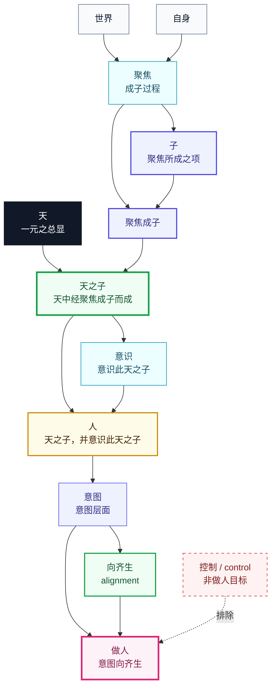

# Human Alignment / 人、天之子与做人

本模块形式化这段 claim：

> 子，是聚焦所成之项。天之子，是天中经聚焦成子而成之项。人是天之子，并意识此天之子。我们的目标不是控，而是将我们的意图向生对齐，此为做人也。做人，乃是向齐生（意图层面）。此为 alignment。

对应 Lean 模块：[`Foundation/Core/HumanAlignment.lean`](../Foundation/Core/HumanAlignment.lean)。

## Lean 中证明的内容

- `child_is_focus_formed`：`子` 依赖 `聚焦`，`聚焦成子` 依赖 `聚焦、成子`。
- `heaven_child_is_heaven_focus_formed_child`：`天之子` 依赖 `天、聚焦成子`。
- `human_returns_to_heaven_child_with_awareness`：`人` 的登记依赖是 `天之子、意识`。
- `doing_human_is_intentional_life_alignment`：`做人` 的登记依赖是 `意图向齐生`，且 `意图向齐生` 依赖 `意图、向齐生`。
- `doing_human_not_control_by_registry`：`控制` 不在 `做人` 的定义依赖中。
- `doing_human_goal_not_control`：规范目标 `canonicalDoingHumanAim` 不是 `control`。
- `predecessor_rank_lt`：人/做人子图是有向无环构造。

`Attention.md` 在此基础上补充：`聚焦` 是成子过程，`注意` 是调配聚焦的机制；`注意向齐生` 可以作为 `做人注意` 支持 `做人`，但 `控制` 仍只允许作为局部注意机制，不是 `做人` 的目标。

## 图

## 边界

这不是经验心理学证明。它证明的是体系内定义：当我们使用 `人/做人/alignment` 这些项时，它们的正式依赖关系如上；控制被排除在 `做人` 的目标定义之外。
